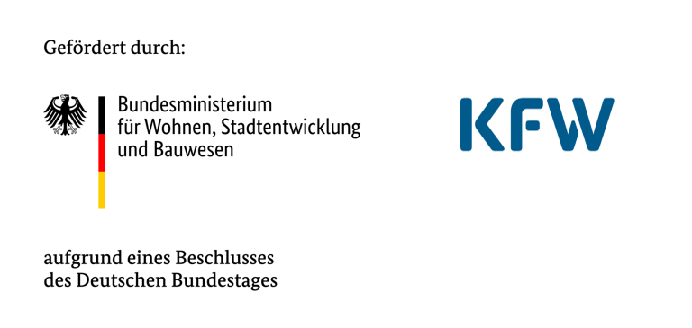

---
toc:
  label: 'Neuigkeiten'
sql:
  long_ma30y: ./dwd/data/long_ma30y.parquet
---

# Willkommen bei der Datenplattform Konstanz

Hier entstehen öffentlich zugängliche Auswertungen zu interessanten
Daten mit Bezug zur Stadt Konstanz. Unser Fokus liegt auf Klima- und
Umweltdaten. Diese Arbeit ist Teil des Projektes
[Klimadatenplattform][project] im Rahmen des Programms [Smart Green
City][sgc] der Stadt Konstanz.

Dieses Projekt ist open-source: wir veröffentlichen unseren Code auf
[Github][repo].

[project]: https://smart-green-city-konstanz.de/klimadatenplattform
[sgc]: https://smart-green-city-konstanz.de/
[repo]: https://github.com/sgc-kn/dashboards/

---

## Oktober 2024

Wir arbeiten an einem Dashboard zu den langjährigen Beobachtungsdaten
des deutschen Wetterdienstes (DWD) in Konstanz.

[➜ Hier geht's zum Dashboard !](dwd/index.html)

Wusstest du, dass es zunehmend mehr heiße Tage in Konstanz gibt?
Der 30-jährige gleitende Durchschnitt von heißen Tagen über 30° Celsius
ist angestiegen von durchschnittlich 8,6 heißen Tagen zwischen 1973 und
2003 auf 15,8 Tagen zwischen 1993 und 2023. Das ist eine Steigerung
um 83%.

```sql id=klindex
select
  year,
  variable,
  coalesce(value::double, 'NaN'::double) as value,
  coalesce(ma30y::double, 'NaN'::double) as ma30y,
from long_ma30y
where variable in ('JA_HEISSE_TAGE', 'JA_SOMMERTAGE')
order by year asc, variable asc
```

```js
const klindex_variables = {
  "JA_EISTAGE": "Eistage (Maximum unter 0°C)",
  "JA_FROSTTAGE": "Frosttage (Minimum unter 0°C)",
  "JA_HEISSE_TAGE": "Heiße Tage (Maximum über 30°C)",
  "JA_SOMMERTAGE": "Sommertage (Maximum über 25°C)",
  "JA_TROPENNAECHTE": "Tropennächte (Minimum über 20°C)",
};

function label_klindex(variable) {
  if (variable in klindex_variables) {
    return klindex_variables[variable]
  } else {
    return variable
  }
};
```

<div class="card">
  <h2>Klimakenntage</h2>
  <h3>Anzahl Tage pro Jahr mit 30-jährigem gleitendem Durchschnitt</h3>
  ${resize((width) => Plot.plot({
      width,
      grid: true,
      inset: 10,
      x: {
        label: 'Jahr',
        labelAnchor: 'center',
        labelArrow: 'none',
      },
      y: {
        label: null,
        labelArrow: 'none',
        tickFormat: Plot.formatNumber("de-DE"),
      },
      color: {
        domain: ["JA_SOMMERTAGE", "JA_HEISSE_TAGE"],
        legend: true,
        tickFormat: label_klindex,
      },
      marks: [
        Plot.frame(),
        Plot.dot(klindex, {
          x: "year",
          y: "value",
          stroke: "variable",
        }),
        Plot.line(klindex, {
          x: "year",
          y: "ma30y",
          stroke: "variable"},
        ),
      ]
    }))}
</div>

---


